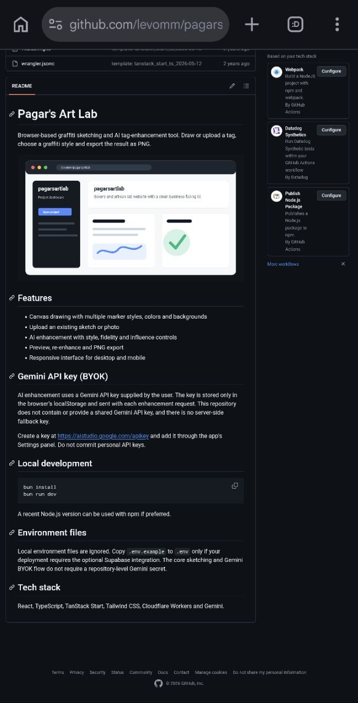

# RAW TAG

### Draw raw. Pick a style. Bomb it.

[](#tech-stack)
[](#tech-stack)
[](#tech-stack)
[](#tech-stack)
[](https://github.com/levomm/raw-tag/actions/workflows/ci.yml)
[](#current-status)
[](#license)

Draw with your finger or stylus, choose from 18 street-art styles, and transform your rough sketch into a finished piece.

[Overview](#overview) · [Features](#features) · [Showcase](#showcase) · [Tech stack](#tech-stack) · [Installation](#installation) · [Security](#security-and-privacy)

| RAW TAG studio | Original hand-drawn tag |
| --- | --- |
|  |  |

## Overview

RAW TAG is a hands-on graffiti sketch lab.

Draw a tag with your finger or stylus, choose a visual style, and turn your rough lines into a polished street-art piece. Your original sketch provides the structure and flow — the selected style shapes the final result.

> You draw it. RAW TAG develops it.

## Features

- Draw directly on a responsive 1280 × 1280 canvas
- Use five drawing tools: marker, fineliner, spray, drip marker and chalk
- Choose from nine marker colors and multiple clean or street-scene backgrounds
- Develop sketches through 18 street-art styles, including bomber, wildstyle, chrome, stencil, calligraphy and halftone
- Control stroke size, source fidelity and transformation influence
- Upload an existing sketch or image
- Undo strokes, clear the canvas and zoom from 25% to 400%
- Preview the developed result before exporting
- Export finished work as PNG
- Use a personal Gemini API key; no shared key is bundled with the project

## Showcase

These visuals demonstrate RAW TAG’s project-specific style direction rather than generic placeholder artwork.

| Wordmark study | Subway scene |
| --- | --- |
|  |  |


## How it works

1. Draw a tag or upload an existing sketch.
2. Select a brush, color, background and street-art style.
3. Adjust fidelity and transformation influence.
4. Open the preview and develop the sketch.
5. Export the finished piece as PNG.

Image transformation is handled through Gemini 2.5 Flash Image. The selected style develops the user’s own sketch rather than replacing the drawing process with a blank-prompt generator.

## Tech stack

- React 19
- TypeScript 5.8
- Vite 7
- TanStack Start and TanStack Router
- Tailwind CSS 4
- Cloudflare Workers integration
- Gemini 2.5 Flash Image

## Installation

### Prerequisites

- A recent Node.js release
- npm or Bun
- A personal Gemini API key for image transformation

### Run locally

```bash
npm install
npm run dev
```

Or with Bun:

```bash
bun install
bun run dev
```

### Validate a change

```bash
npm run lint
npm run format:check
npm run build
```

## Gemini API key

RAW TAG uses a key supplied by the user. The key is stored in the browser’s local storage, sent to the application server only for an image-transformation request and forwarded to Gemini. The server function does not persist it, and this repository does not contain a shared Gemini key.

Create a key in [Google AI Studio](https://aistudio.google.com/apikey), add it through RAW TAG’s settings panel and remove it after use on a shared device.

## Current status

The core drawing, upload, style transformation, preview and PNG export flows are implemented. No public production deployment is currently linked from this repository.

## Security and privacy

- No Gemini API key is committed or bundled with the project.
- Local environment and Wrangler secret files are ignored.
- Do not use a personal API key in an untrusted or shared browser profile.
- Report credential or security issues privately instead of opening a public issue containing sensitive data.

## License

No open-source license has been granted. This repository is public for portfolio and review purposes; all rights remain reserved unless a license is added later.
