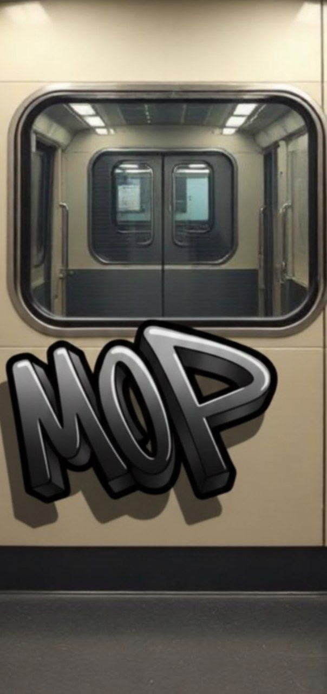

# Pagar's Art Lab

**A browser-based graffiti sketching and AI-assisted tag enhancement studio.**

Draw a tag from scratch or upload an existing sketch, choose a visual direction, tune the AI influence and export the result as PNG.


## What it does

- Draw on a canvas with multiple marker styles, colors and backgrounds
- Upload an existing sketch or photo
- Enhance artwork with selectable graffiti styles
- Control fidelity and AI influence instead of accepting a one-click black box
- Preview, iterate and export the finished result as PNG
- Use your own Gemini API key — no shared server-side key is included

## Visual showcase

These are project-specific style outputs and visual-direction examples used for Pagar's Art Lab — not generic dashboard placeholders.

| Wordmark study | Subway scene |
| --- | --- |
|  |  |


## Gemini BYOK

AI enhancement uses a Gemini API key supplied by the user. The key is stored only in the browser's local storage and sent with enhancement requests. This repository does not contain or provide a shared Gemini key.

Create a key at [Google AI Studio](https://aistudio.google.com/apikey), then add it in the app's settings panel. Never commit a personal API key.

## Local development

```bash
bun install
bun run dev
```

A recent Node.js version can be used with npm if preferred.

## Environment files

Local environment files are ignored. Copy `.env.example` to `.env` only if your deployment requires the optional Supabase integration. The core sketching and Gemini BYOK flow does not require a repository-level Gemini secret.

## Tech stack

React, TypeScript, TanStack Start, Tailwind CSS, Cloudflare Workers and Gemini.
