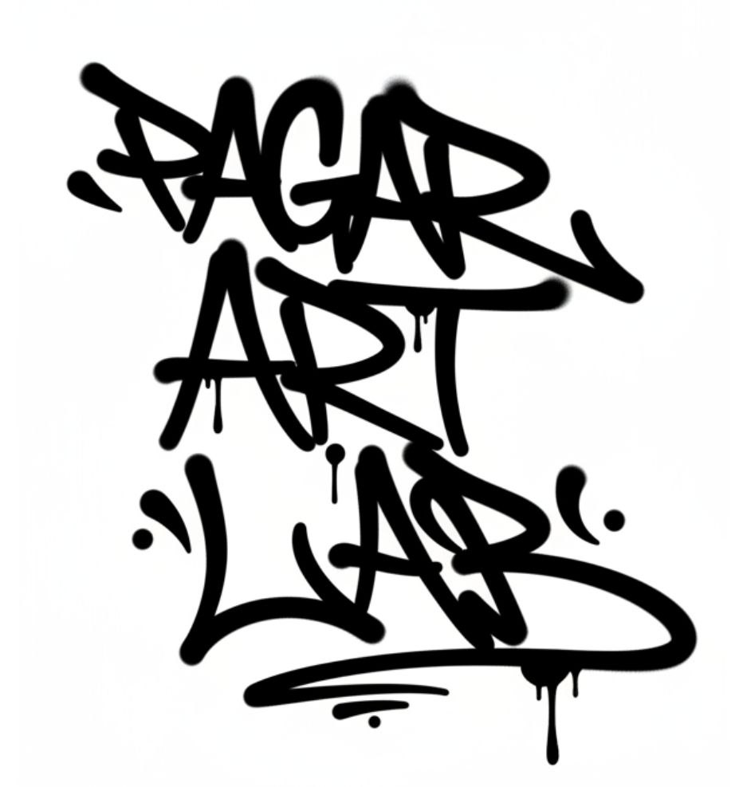

# RAW TAG

**A browser-based graffiti sketching and AI-assisted tag enhancement studio.**

Draw a tag from scratch or upload an existing sketch, choose a visual direction, tune the AI influence and export the result as PNG.


## What it does

- Draw on a canvas with multiple marker styles, colors and backgrounds
- Upload an existing sketch or photo
- Enhance artwork with selectable graffiti styles
- Control fidelity and AI influence instead of accepting a one-click black box
- Preview, iterate and export the finished result as PNG
- Use your own Gemini API key — no shared server-side key is included

## Visual showcase

These are project-specific style outputs and visual-direction examples used for RAW TAG — not generic dashboard placeholders.

| Wordmark study                                                               | Subway scene                                                                                     |
| ---------------------------------------------------------------------------- | ------------------------------------------------------------------------------------------------ |
|  |  |


## Gemini BYOK

AI enhancement uses a Gemini API key supplied by the user. The key is stored in the browser's local storage, sent to the app server only for an enhancement request and forwarded to Gemini. The server-side function does not persist the key. This repository does not contain or provide a shared Gemini key.

Because the browser stores the key in local storage, use this tool only on a trusted device and browser profile. Remove the key from the settings panel when finished on a shared device.

Create a key at [Google AI Studio](https://aistudio.google.com/apikey), then add it in the app's settings panel. Never commit a personal API key.

## Current status

- Core drawing, upload, AI enhancement, preview and PNG export flows are implemented.
- Gemini enhancement requires a user-supplied API key.
- Supabase environment variables are optional scaffold integrations and are not required for the core flow.
- No production deployment URL is currently published in this repository.

## Local development

```bash
bun install
bun run dev
```

A recent Node.js version can be used with npm if preferred.

Validate the project before a pull request:

```bash
bun run lint
bun run build
```

## Environment files

Local environment files are ignored. Copy `.env.example` to `.env` only if your deployment requires the optional Supabase integration. The core sketching and Gemini BYOK flow does not require a repository-level Gemini secret.

## Tech stack

React, TypeScript, TanStack Start, Tailwind CSS, Cloudflare Workers and Gemini.

## Security and privacy

- No Gemini API key is bundled in the repository.
- Local `.env` and Wrangler secret files are ignored.
- Do not paste a Gemini key into a shared browser profile.
- Report security issues privately through the repository owner rather than opening a public issue containing credentials.

## License

No open-source license has been granted yet. The repository is public for portfolio and review purposes; all rights remain reserved unless a license is added later.
